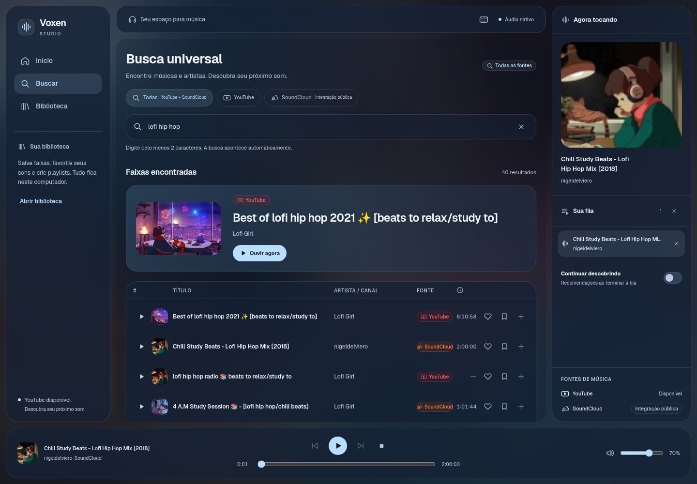

<div align="center">
  
  <h1>Voxen</h1>
  <p><strong>Seu próximo som. No seu próprio espaço.</strong></p>
  <p>Player desktop para Linux e Windows, com busca no YouTube e SoundCloud,<br />biblioteca local e descobertas a partir do que você ouve.</p>
  <p>
    <a href="https://github.com/EliasArruda/Voxen/actions/workflows/checks.yml"></a>
    
    
  </p>
  <p><a href="#começar">Começar</a> · <a href="#recursos">Recursos</a> · <a href="#atalhos">Atalhos</a> · <a href="#desenvolvimento">Desenvolvimento</a></p>
</div>



Voxen reúne pesquisa, biblioteca e reprodução em uma interface de vidro azul. Usa a WebView do sistema para a interface e **FFmpeg + SDL3 para o áudio**, sem Electron ou Chromium embarcado. Músicas são transmitidas; salvar uma faixa guarda seus metadados, não uma cópia offline.

## Recursos

- **Busca Todas:** YouTube e SoundCloud juntos, com resultados progressivos e filtros por fonte. Integração pública SoundCloud sem credenciais pessoais. API oficial do SoundCloud disponível como opção.
- **Player nativo:** reprodução, pausa, anterior/próxima, avanço na faixa, volume e fila com até 200 entradas.
- **Biblioteca local:** músicas salvas, favoritos e playlists que podem ser criadas, renomeadas, editadas e reproduzidas.
- **Descobertas pessoais:** recomendações a partir dos artistas ouvidos, favoritos, frequência e recência, com motivos visíveis.
- **Continuar descobrindo:** reprodução automática opcional depois da fila; suas escolhas manuais têm prioridade.
- **Teclado e acessibilidade:** atalhos com proteção para campos de texto, foco visível, ajuda e estados de erro com recuperação.
- **Studio responsivo:** navegação, conteúdo e inspector em três colunas; a fila vira painel recolhível em janelas menores.

## Começar

### Pacote portátil

1. Abra [Build, checks and portable packages](https://github.com/EliasArruda/Voxen/actions/workflows/checks.yml) e escolha uma execução **bem-sucedida da branch `main`**.
2. Baixe o artefato `Voxen-linux-x64` ou `Voxen-win-x64`. O GitHub pode exigir login para baixar artefatos.
3. Extraia o pacote inteiro, mantendo suas pastas, e execute `Voxen` no Linux ou `Voxen.exe` no Windows.

No Linux, se a extração não preservar a permissão de execução:

```sh
chmod +x Voxen tools/ffmpeg/ffmpeg
./Voxen
```

Os pacotes incluem .NET, SDL3 e FFmpeg. Precisam de sessão gráfica, saída de áudio e WebView nativa: **WebKitGTK no Linux** ou **WebView2 no Windows**. O áudio nativo não exige plugins GStreamer. Os artefatos da CI ficam disponíveis por 14 dias; ainda não há um instalador ou release estável publicado.

### Primeira música

Abra **Buscar**. A opção **Todas** combina as duas fontes; YouTube e SoundCloud continuam disponíveis separadamente. Explore as ideias musicais iniciais ou digite uma música ou artista. Clique em **Ouvir agora** ou no play da linha. Use **+** para montar a fila, o **coração** para favoritar e o **marcador** para salvar na biblioteca.

Em **Biblioteca**, crie uma playlist. Escolha a coleção Salvas ou Favoritos, selecione a playlist de destino e adicione as faixas. **Ouvir coleção** adiciona as músicas à fila e inicia a primeira. Exclusão de playlist e limpeza de histórico pedem confirmação.

### Início do áudio e atmosfera

O destaque da busca, a próxima faixa da fila e a candidata de reprodução automática podem preparar o stream antes do clique. Focar ou passar o cursor no play de uma linha também prepara aquela faixa. A preparação guarda somente metadados e pequenos manifestos em memória por até 90 segundos, com no máximo oito entradas; não baixa a música inteira. Preparação e reprodução compartilham a resolução. URLs que falham são descartadas para a próxima tentativa.

O limite de início é de 20 segundos, do clique ao primeiro áudio. Se a fonte não responder, o player encerra a tentativa e oferece repetir ou escolher outra faixa. A conexão e a duração dependem da fonte e da rede; os testes Linux de faixas já preparadas iniciaram em aproximadamente 100–252 ms.

A capa da faixa colore suavemente o fundo através do vidro. Trocas de capa e chegada de resultados têm transições discretas; a preferência do sistema por movimento reduzido é respeitada.

## Como funcionam as recomendações

O Voxen constrói um perfil local a partir de escutas qualificadas e favoritos. Uma escuta conta após **30 segundos ou metade da duração**, com mínimo de **5 segundos**. Pausa e avanços manuais não contam como escuta.

A seleção usa afinidade por artista e palavras dos títulos, favoritos, repetição e recência. Busca candidatos em até três referências de artistas, remove as últimas 20 faixas ouvidas e as faixas da fila, filtra gravações duplicadas e limita a duas recomendações por artista. A duração também evita privilegiar mixes muito longos.

Esse método usa metadados, não análise sonora ou um modelo de IA. Em títulos convencionais “Artista - Música”, o artista pode ser inferido do título; nos demais casos, o canal/uploader é a referência disponível. Uma conta nova recebe descobertas iniciais; ouvir e favoritar melhora a seleção. **Atualizar descobertas** refaz a busca com seu perfil atual.

**Continuar descobrindo** prepara uma candidata durante a última faixa. Ao terminar a fila, ela entra somente se o recurso continuar ativo e não houver uma escolha manual. Ativar depois que a faixa terminou também inicia uma descoberta. Parar, limpar a fila ou desligar o recurso cancela a continuação pendente.

## Atalhos

Funcionam com a janela do Voxen em foco. Campos de texto, composição de teclado e controles nativos mantêm seu comportamento. A ajuda também está no botão de teclado da barra superior.

| Ação | Atalho |
| --- | --- |
| Buscar e focar pesquisa | `Ctrl + K` ou `/` |
| Reproduzir / pausar | `Espaço` |
| Próxima / anterior | `N` / `P` |
| Avançar / voltar 5 segundos | `Direita` / `Esquerda` |
| Aumentar / reduzir volume em 5% | `Cima` / `Baixo` |
| Silenciar / restaurar volume | `M` |
| Favoritar faixa atual | `F` |
| Salvar faixa atual | `B` |
| Abrir / fechar fila | `Q` |
| Biblioteca / início | `Alt + L` / `Alt + H` |
| Mostrar ajuda | `?` |
| Fechar ajuda ou fila | `Esc` |

## SoundCloud

Por padrão, o Voxen pesquisa faixas públicas pelo adaptador do site e reproduz o áudio no mesmo motor FFmpeg/SDL do YouTube. **Você não precisa fornecer uma chave.** O adaptador descobre a identificação pública usada pelo site e a mantém temporariamente em memória. Não exige login ou armazena cookies da sua conta.

Essa integração é **não oficial**: endpoints internos podem mudar e interromper busca ou reprodução até uma atualização. Faixas bloqueadas, previews e formatos protegidos não são oferecidos como reprodução completa. Restrições da fonte continuam aplicáveis.

Para usar a API oficial, configure estas variáveis no ambiente antes de iniciar:

| Variável | Uso |
| --- | --- |
| `VOXEN_SOUNDCLOUD_CLIENT_ID` | Identificador do aplicativo autorizado |
| `VOXEN_SOUNDCLOUD_CLIENT_SECRET` | Segredo do aplicativo autorizado |

Quando ambas existem, a API oficial tem prioridade. Não coloque valores no código, commits ou pacotes distribuídos. `.env` não é carregado automaticamente. OAuth/refresh e HLS oficiais são cobertos por fixtures HTTP; a validação real sem credenciais usa o adaptador público.

## Seus dados

A biblioteca guarda somente metadados em:

- Linux: normalmente `~/.local/share/Voxen/library.json`.
- Windows: `%LOCALAPPDATA%\Voxen\library.json`.

O histórico é local e pode ser apagado pela biblioteca. Não há sincronização de conta. Pesquisas e pedidos de áudio são enviados às fontes correspondentes; o perfil local não é enviado como um cadastro externo. A fila dura apenas a sessão.

O armazenamento aceita até 2.000 faixas salvas, 2.000 favoritos, 100 playlists com 500 faixas cada e 1.000 entradas de histórico, dentro de um limite total de 8 MB. Arquivos inválidos são preservados e informados; gravações são atômicas. Apenas uma instância do aplicativo roda por usuário para evitar sobrescritas concorrentes. Para fazer backup, copie `library.json` com o aplicativo fechado.

## Desenvolvimento

Requer **SDK .NET 10**, FFmpeg no `PATH` e as dependências nativas da WebView. Node é necessário para os checks JavaScript; Python 3 é usado no empacotamento.

```sh
git clone https://github.com/EliasArruda/Voxen.git
cd Voxen
dotnet restore
dotnet run
```

Para escolher outro FFmpeg, configure `VOXEN_FFMPEG_PATH` com o caminho do executável. A execução procura, nesta ordem: essa variável, `tools/ffmpeg` do pacote e o `PATH`. Não é necessário compilar Node/Tailwind para iniciar; CSS, scripts e fontes utilizados já estão no repositório.

### Verificar

```sh
dotnet build --configuration Release
dotnet run --project Tests/Voxen.Checks.csproj --configuration Release
npm test
```

Áudio nativo com saída simulada, para teste sem dispositivo de som:

```sh
SDL_AUDIODRIVER=dummy dotnet run --project Tests/Voxen.Checks.csproj --configuration Release -- --native
```

No PowerShell, defina `$env:SDL_AUDIODRIVER = 'dummy'` antes do comando `dotnet run`. Testes de rede externos são opcionais:

```sh
dotnet run --project Tests/Voxen.Checks.csproj -- --youtube
dotnet run --project Tests/Voxen.Checks.csproj -- --soundcloud
```

A CI executa build, checks determinísticos, regressões JavaScript, empacotamento e checks nativos em **Linux e Windows**. Busca externa não é requisito da CI. Áudio real do YouTube e SoundCloud e controles nativos foram validados no Linux; fluxos compartilhados da interface foram testados em Chromium. A interface gráfica do Windows ainda precisa de homologação em dispositivo.

### Gerar pacotes

```sh
python3 scripts/publish.py --rid linux-x64 --output artifacts/Voxen-linux-x64
python3 scripts/publish.py --rid win-x64 --output artifacts/Voxen-win-x64
```

O script gera uma aplicação self-contained e inclui um build fixado de FFmpeg, com SHA-256 verificado. O primeiro uso baixa um arquivo grande, mantido em cache local ignorado pelo Git. Licenças e origem do FFmpeg acompanham o pacote.

## Arquitetura

| Camada | Responsabilidade |
| --- | --- |
| Blazor + PhotinoX | Interface na WebView nativa |
| `SearchSession` | Debounce de 350 ms, cancelamento e proteção contra resultados antigos |
| `MusicProviders` | Roteamento YouTube / SoundCloud oficial ou público |
| `AudioPreparationService` | Preparação compartilhada e cache temporário de metadados |
| `PlayerService` + `PlaybackCoordinator` | Estado, transporte, fila e continuação automática |
| `NativeAudioService` | Um processo FFmpeg, PCM limitado e saída SDL3 |
| `AudioProxy` | Stream atual, token de sessão e HTTP Range em loopback |
| `LibraryService` + `ListeningHistoryService` | Metadados persistidos e escutas qualificadas |
| `RecommendationService` | Afinidade local, exclusões e diversidade |

O proxy escuta somente em `127.0.0.1`, numa porta efêmera. O áudio não é baixado integralmente para disco. A prévia de navegador usada nos testes possui um backend HTML5 separado, com hls.js como fallback HLS; o desktop usa o motor nativo.

## Contribuir

Trabalhe em uma branch focada e abra um pull request com problema, solução e verificações. Separe incrementos coerentes, evite incluir credenciais e confirme que os checks de Linux e Windows passam. Bugs reproduzíveis podem ser reportados em [Issues](https://github.com/EliasArruda/Voxen/issues), com plataforma, passos e mensagem de erro.

## Tecnologias e créditos

Voxen é independente de YouTube e SoundCloud. Serviços e conteúdo permanecem sujeitos às condições das fontes.

- [PhotinoX](https://github.com/PhotinoX/PhotinoX) — janela e WebView nativas.
- [YoutubeExplode](https://github.com/Tyrrrz/YoutubeExplode) — pesquisa e streams do YouTube.
- [FFmpeg](https://ffmpeg.org/) e [SDL3](https://libsdl.org/) — áudio nativo.
- [SoundCloud Developers](https://developers.soundcloud.com/) — API oficial e documentação.
- [Geist](https://github.com/vercel/geist-font) e [Inter](https://github.com/rsms/inter) — fontes locais, com arquivos OFL no repositório.
- [hls.js](https://github.com/video-dev/hls.js) — backend opcional da prévia, com aviso de licença local.

A composição Studio segue a referência WaveMix selecionada para o projeto, adaptada ao vidro azul e às formas arredondadas do Voxen. Decisões visuais estão em [DESIGN.md](DESIGN.md).
